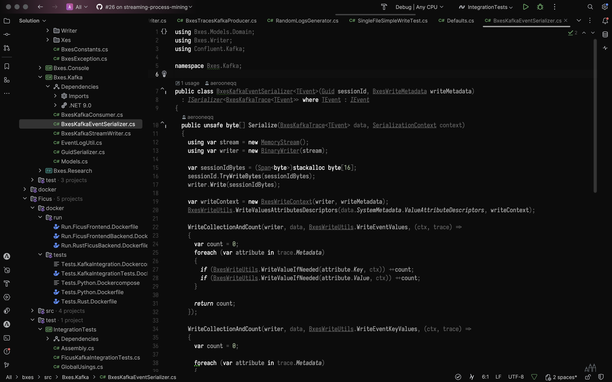

Just some themes for fun.

Initially theme settings are copy-pasted from https://github.com/JetBrains/rider-theme-pack, then adjusted.

Now plugin contains the following themes:
- Absolute Dark
  
  Rider AbsoluteDark theme:
  

  Rust AbsoluteDark theme:
  

  PyCharm AbsoluteDark theme:
  