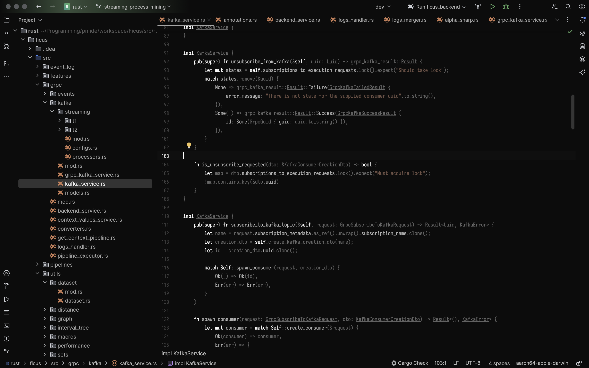
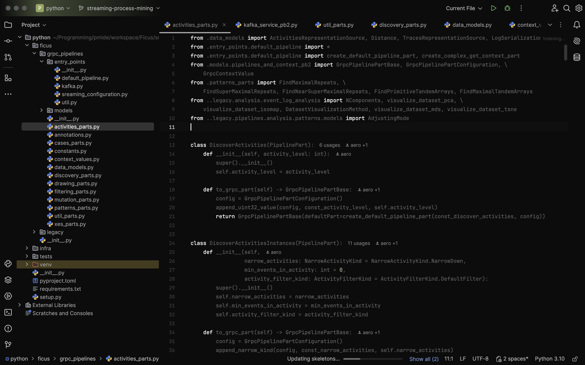

Just some themes for fun.

Themes are created based on [rider-theme-pack](https://github.com/JetBrains/rider-theme-pack) and then adjusted through IDEs.

Now plugin contains the following themes:
- Absolute Dark
  
  Rider AbsoluteDark theme:
  

  Rust AbsoluteDark theme:
  

  PyCharm AbsoluteDark theme:
  